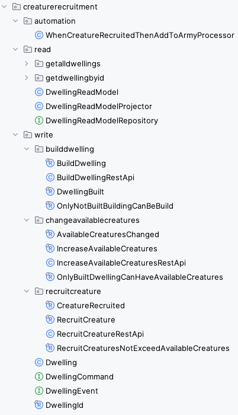

# Heroes of Domain-Driven Design (Java)
Shows how to use Domain-Driven Design, Event Storming, Event Modeling and Event Sourcing in Heroes of Might & Magic III domain.

👉 See also implementations in: [Ruby](https://github.com/MateuszNaKodach/HeroesOfDomainDrivenDesign.EventSourcing.Ruby) | **Java + Spring + Axon**

👉 [Let's explore the Heroes of Domain-Driven Design blogpost series](https://dddheroes.com/)
- There you will get familiar with the whole Software Development process: from knowledge crunching with domain experts, designing solution using Event Modeling, to implementation using DDD Building Blocks.

This project probably won't be fully-functional HOMM3 engine implementation, because it's done for educational purposes.
If you'd like to talk with me about mentioned development practices fell free to contact on [linkedin.com/in/mateusznakodach/](https://www.linkedin.com/in/mateusznakodach).

I'm focused on domain modeling on the backend, but I'm going to implement UI like below in the future.


## 🚀 How to run the project locally?

0. Install Java 23 on your machine
1. `./mvnw install -DskipTests`
2. `docker compose up`
3. `./mvnw spring-boot:run` or `./mvnw test`

## 🧱 Modules

Modules (mostly designed using Bounded Context heuristic) are designed and documented on EventModeling below.
Each slice in a module is in certain color which shows the progress:
- green -> completed
- yellow -> implementation in progress
- red -> to do
- grey -> design in progress

List of modules you can see in package `com.dddheroes.heroesofddd`.
```
heroesofddd/
├── armies
├── astrologers
├── calendar
├── creature_recruitment
```

Each domain-focused module follows Vertical-Slice Architecture of three possible types: write, read and automation following Event Modeling nomenclature.

### 👾 Creature Recruitment


Slices:
- Write: [BuildDwelling -> DwellingBuilt](src/main/java/com/dddheroes/heroesofddd/creaturerecruitment/write/builddwelling) | [test](src/test/java/com/dddheroes/heroesofddd/creaturerecruitment/write/builddwelling/BuildDwellingTest.java)
- Write: [IncreaseAvailableCreatures -> AvailableCreaturesChanged](src/main/java/com/dddheroes/heroesofddd/creaturerecruitment/write/changeavailablecreatures) | [test](src/test/java/com/dddheroes/heroesofddd/creaturerecruitment/write/changeavailablecreatures/IncreaseAvailableCreaturesTest.java)
- Write: [RecruitCreature -> CreatureRecruited](src/main/java/com/dddheroes/heroesofddd/creaturerecruitment/write/recruitcreature) | [test](src/test/java/com/dddheroes/heroesofddd/creaturerecruitment/write/recruitcreature)
- Read: (DwellingBuilt, AvailableCreaturesChanged, CreatureRecruited) -> DwellingReadModel [projector](src/main/java/com/dddheroes/heroesofddd/creaturerecruitment/read/DwellingReadModelProjector.java)
  - GetDwellingById: [query](src/main/java/com/dddheroes/heroesofddd/creaturerecruitment/read/getdwellingbyid/GetDwellingByIdQueryHandler.java) | [test](src/test/java/com/dddheroes/heroesofddd/creaturerecruitment/read/getdwellingbyid/GetDwellingByIdTest.java)

Aggregates:
- [Dwelling](src/main/java/com/dddheroes/heroesofddd/creaturerecruitment/write/Dwelling.java)

### 🧙 Astrologers


Slices:
- Write: [ProclaimWeekSymbol -> WeekSymbolProclaimed](heroesofddd_rails_application/lib/heroes/astrologers/write/proclaim_week_symbol/command_proclaim_week_symbol.rb) | [test](heroesofddd_rails_application/test/lib/heroes/astrologers/write/proclaim_week_symbol_application_test.rb)
- Automation: [DayStarted(where day==1) -> ProclaimWeekSymbol](heroesofddd_rails_application/lib/heroes/astrologers/automation/when_week_started_then_proclaim_week_symbol.rb) | [test](heroesofddd_rails_application/test/lib/heroes/astrologers/automation/when_week_started_then_proclaim_week_symbol_test.rb)
- Automation: [(WeekSymbolProclaimed, all game dwellings derived from DwellingBuilt events) -> IncreaseAvailableCreatures for each dwelling in the game where creature == symbol](heroesofddd_rails_application/lib/heroes/astrologers/automation/when_week_symbol_proclaimed_then_increase_dwelling_available_creatures.rb) | [test](heroesofddd_rails_application/test/lib/heroes/astrologers/automation/when_week_symbol_proclaimed_then_increase_dwelling_available_creatures_test.rb)

Aggregates:
- [WeekSymbol](heroesofddd_rails_application/lib/heroes/astrologers/write/week_symbol.rb)

### 📅 Calendar


Slices:
- Write: [StartDay -> DayStarted](heroesofddd_rails_application/lib/heroes/calendar/write/start_day/command_start_day.rb) | [test](heroesofddd_rails_application/test/lib/heroes/calendar/write/start_day_application_test.rb)
- Write: [FinishDay -> DayFinished](heroesofddd_rails_application/lib/heroes/calendar/write/finish_day/command_finish_day.rb) | [test](heroesofddd_rails_application/test/lib/heroes/calendar/write/finish_day_application_test.rb)
- Read: [DayStarted -> CurrentDateReadModel](heroesofddd_rails_application/lib/heroes/calendar/read/current_date_read_model.rb) | [test](heroesofddd_rails_application/test/lib/heroes/calendar/read/current_date_read_model_application_test.rb)

Aggregates:
- [Calendar](heroesofddd_rails_application/lib/heroes/calendar/write/calendar.rb)

## 🏛️ Screaming Architecture
// todo: fix this descirption, add screen
All of this is an example of screaming architecture, where you can see the possible operations (command, queries) what may happen in your app (events) and what are the rules.




## 🧪 Testing
Tests using Real postgres Event Store, follows the approach:
- write slice: given(events) -> when(command) -> then(events)
- read slice: given(events) -> then(read model)
- automation: when(event, state?) -> then(command)

Tests are focused on observable behavior which implicitly covers the DDD Aggregates, so the domain model can be refactored without changes in tests.

### Example: write slice


```java
@BeforeEach
void setUp() { // Axon Framework Test Fixture
    fixture = new AggregateTestFixture<>(Dwelling.class);
}
    
@Test
void givenDwellingWith2Creatures_WhenRecruit2Creatures_ThenRecruited() {
    // given
    var givenEvents = List.of(
            dwellingBuilt(),
            availableCreaturesChanged(2)
    );

    // when
    var whenCommand = recruitCreature(2);

    // then
    var thenEvent = creatureRecruited(2);
    fixture.given(givenEvents)
           .when(whenCommand)
           .expectEvents(thenEvent);
}
```


-------

### 💼 Hire me

If you'd like to hire me for Domain-Driven Design and/or Event Sourcing projects I'm available to work with:
Kotlin, Java, C# .NET, Ruby and JavaScript/TypeScript (Node.js or React).
Please reach me out on LinkedIn [linkedin.com/in/mateusznakodach/](https://www.linkedin.com/in/mateusznakodach/).
