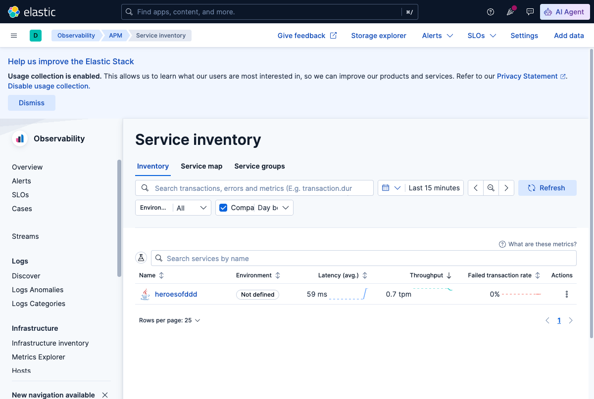
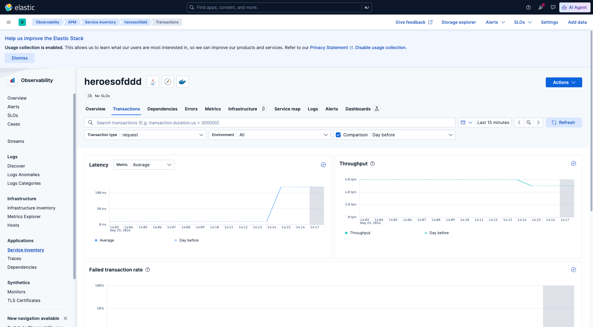
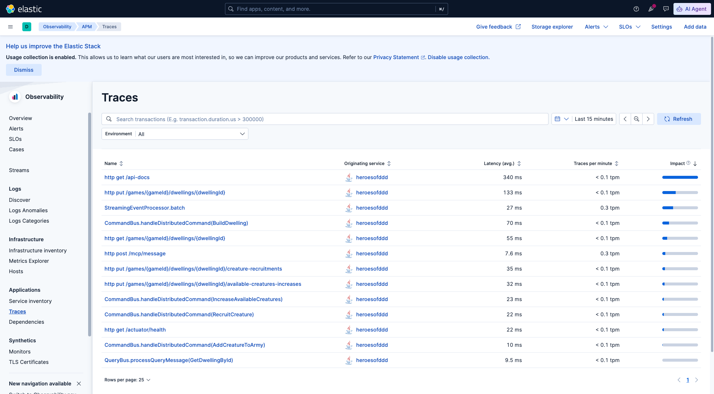
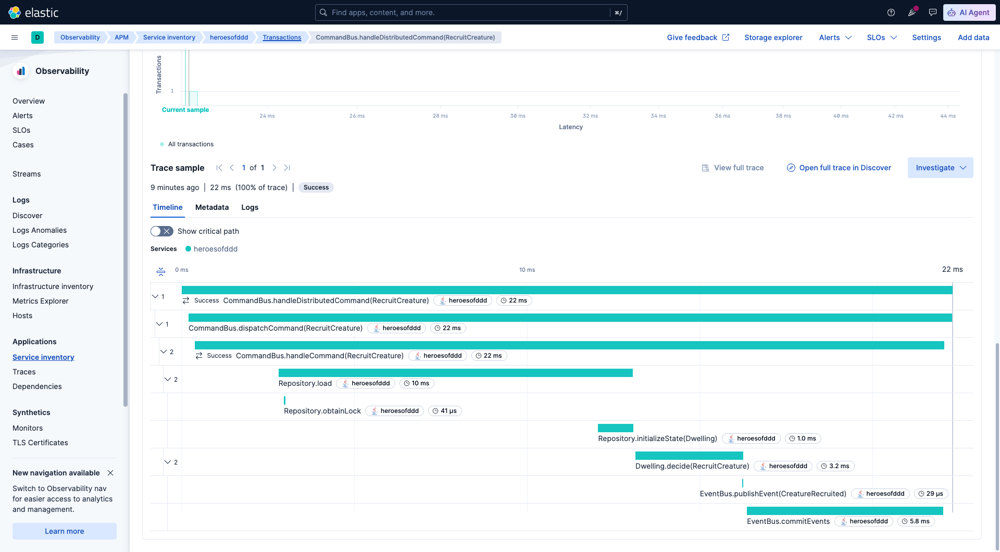
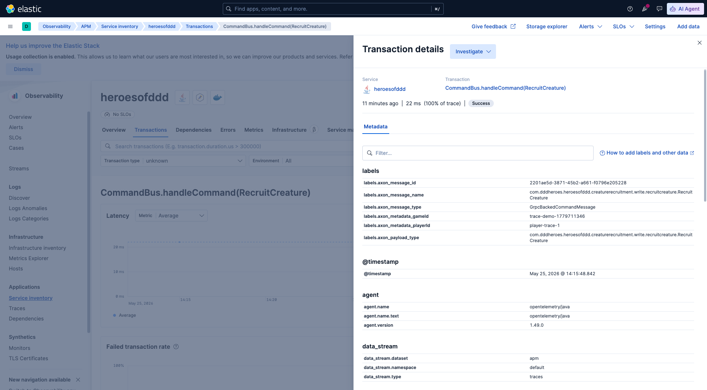

# 📊 Observability — distributed tracing

The app can emit distributed traces to an Elastic APM stack (Elasticsearch + Kibana + APM Server) via OpenTelemetry. Tracing is **off by default** and activated by the `observability` Spring profile, with its own Docker Compose overlay.

> 👉 Back to the [main README](../README.md).

## Table of contents

1. [Stack](#stack)
2. [Run with tracing enabled](#run-with-tracing-enabled)
3. [Run without tracing (default)](#run-without-tracing-default)
4. [Ports & URLs](#ports--urls)
5. [Exploring traces in Kibana — guided tour](#exploring-traces-in-kibana--guided-tour)
6. [Useful Kibana filters](#useful-kibana-filters)
7. [Why Axon splits work across multiple traces](#why-axon-splits-work-across-multiple-traces)

## Stack

| Component | Role |
|---|---|
| [`axon-tracing-opentelemetry`](https://docs.axoniq.io/axon-framework-reference/4.13/monitoring/tracing/) | Instruments command/event/query handlers, aggregates, repositories, event store |
| [`micrometer-tracing-bridge-otel`](https://docs.spring.io/spring-boot/reference/actuator/tracing.html) | Spring Boot's official bridge from Micrometer Observation to OpenTelemetry |
| [`opentelemetry-exporter-otlp`](https://opentelemetry.io/docs/specs/otlp/) | Pushes traces over OTLP/HTTP to the APM Server |
| [Elastic APM 9.x](https://www.elastic.co/observability/application-performance-monitoring) | Receives OTLP, stores in Elasticsearch, visualizes in Kibana |

Activation surface:
- New Spring profile **`observability`**
- New Docker Compose overlay **`docker-compose.observability.yaml`** (Elasticsearch + Kibana + APM Server, pinned to `9.4.1`)
- New config file **`apm-server.docker.yml`** mounted into the APM Server container
- New profile-specific config **`src/main/resources/application-observability.yaml`** (enables tracing, 100% sampling, OTLP endpoint)
- New bean in **`shared/infrastructure/TracingConfiguration.java`** — wires Axon's `OpenTelemetrySpanFactory` to Micrometer-managed `OpenTelemetry` so Axon and Spring spans land in the same trace tree

## Run with tracing enabled

1. Start the base stack + observability stack:
   ```bash
   docker compose -f docker-compose.yaml -f docker-compose.observability.yaml up -d
   ```
   Wait ~60s for Elasticsearch and Kibana to be ready.

2. Run the app with the `observability` profile:
   ```bash
   SPRING_PROFILES_ACTIVE=observability ./mvnw spring-boot:run
   ```
   Or via Maven flag: `./mvnw spring-boot:run -Dspring-boot.run.profiles=observability`.

3. Generate some traffic via Swagger UI at [http://localhost:3773/swagger-ui/index.html](http://localhost:3773/swagger-ui/index.html).

4. Open Kibana APM — see [the guided tour below](#exploring-traces-in-kibana--guided-tour).

## Run without tracing (default)

```bash
docker compose up -d
./mvnw spring-boot:run
```

No `observability` profile = no traces emitted, no extra containers needed. Useful for daily development.

## Ports & URLs

| Service                    | Port | URL                                                                                       |
|----------------------------|------|-------------------------------------------------------------------------------------------|
| Kibana (APM UI)            | 5601 | [http://localhost:5601](http://localhost:5601)                                            |
| Kibana → APM → Services    |      | [http://localhost:5601/app/apm/services](http://localhost:5601/app/apm/services)          |
| Kibana → APM → Traces      |      | [http://localhost:5601/app/apm/traces](http://localhost:5601/app/apm/traces)              |
| Elasticsearch              | 9200 | [http://localhost:9200](http://localhost:9200)                                            |
| APM Server (OTLP receiver) | 8200 | [http://localhost:8200/v1/traces](http://localhost:8200/v1/traces)                        |

## Exploring traces in Kibana — guided tour

A quick walkthrough of what you can see and where to click. Examples below were captured after running the full chain `BuildDwelling → IncreaseAvailableCreatures → RecruitCreature → GetDwellingById` through Swagger UI.

### 1. Service inventory

[Kibana → ☰ → Observability → APM → Services](http://localhost:5601/app/apm/services) — landing page lists every service emitting traces. After firing a few requests you should see `heroesofddd` with average latency, throughput, and error rate.



### 2. Transactions

Click `heroesofddd` → **Transactions** tab. Each row is a distinct "entry point" — both HTTP endpoints (auto-instrumented by Spring Web) and Axon's async boundaries (each command/event/query handler is a top-level transaction because Axon hops across the gRPC bus and async event processors).



### 3. Traces — the full list

[Kibana → APM → Traces](http://localhost:5601/app/apm/traces) shows every individual trace tree.

For this project you'll see roots like:
- `http put /games/{gameId}/dwellings/{dwellingId}` — HTTP root
- `CommandBus.handleDistributedCommand(RecruitCreature)` — command handling on the aggregate side after the gRPC hop to Axon Server
- `StreamingEventProcessor.process(CreatureRecruited)` — projector / automation
- `CommandBus.handleCommand(AddCreatureToArmy)` — command emitted by the `WhenCreatureRecruitedThenAddToArmy` automation
- `QueryBus.processQueryMessage(GetDwellingById)` — query side



### 4. Trace waterfall — Axon internals visible

Click any `CommandBus.handleCommand(...)` trace and Kibana renders a waterfall like this — the full call path of the Axon command handler, including aggregate loading and event publication:



What you're looking at:

```
✓ CommandBus.handleDistributedCommand(RecruitCreature)     22 ms     ← gRPC server side
  └─ CommandBus.dispatchCommand(RecruitCreature)           22 ms
     └─ CommandBus.handleCommand(RecruitCreature)          22 ms
        ├─ Repository.load                                 10 ms     ← event sourcing
        │  ├─ Repository.obtainLock                        41 μs
        │  └─ Repository.initializeState(Dwelling)          1.0 ms   ← rehydrate aggregate
        ├─ Dwelling.decide(RecruitCreature)                 3.2 ms   ← AGGREGATE business logic
        ├─ EventBus.publishEvent(CreatureRecruited)        29 μs
        └─ EventBus.commitEvents                            5.8 ms   ← persist to event store
```

This is *exactly* the layered shape from Event Sourcing theory — repository → aggregate → event publication — rendered as data, not as a diagram in a slide.

### 5. Span attributes — gameId, playerId, message metadata

Click any Axon span (e.g. `CommandBus.handleCommand(RecruitCreature)`) → **Metadata** tab. The flyout shows OpenTelemetry attributes — including correlation data injected by `GameConfiguration.gameDataProvider`:



```
labels.axon_metadata_gameId    = scenario-1                  ← from gameDataProvider
labels.axon_metadata_playerId  = player-1                    ← from gameDataProvider
labels.axon_message_id         = 2201ae5d-3871-45b2-a661-...
labels.axon_message_name       = com.dddheroes…RecruitCreature
labels.axon_message_type       = GrpcBackedCommandMessage
labels.axon_payload_type       = com.dddheroes…RecruitCreature
```

This is the practical payoff: filtering traces by `labels.axon_metadata_gameId : "scenario-1"` in the Kibana search bar isolates every span — across every aggregate, processor and projector — that participated in one game session.

## Useful Kibana filters

Paste into the Kibana search bar (KQL) at the top of any APM page:

| Goal | KQL |
|---|---|
| Traces for one game | `labels.axon_metadata_gameId : "scenario-1"` |
| Only command handlers | `transaction.name : "CommandBus.handleCommand*"` |
| Only one aggregate's decisions | `span.name : "Dwelling.decide(*)"` |
| Only automation reactions | `span.name : "*Processor.react(*)"` |
| Only event publications | `span.name : "EventBus.publishEvent(*)"` |

## Why Axon splits work across multiple traces

You'll notice that an HTTP request often produces *two or three* separate trace trees rather than one giant tree. That's expected. Axon hops over async boundaries that don't preserve OpenTelemetry context: the gRPC call to Axon Server (server-side `handleDistributedCommand` starts a new root) and the asynchronous event processors (each `process(Event)` is its own root). Inside one boundary, however, the tree is complete — as the waterfall above shows.

To stitch sessions together end-to-end, use the `axon_metadata_gameId` label filter described above.
